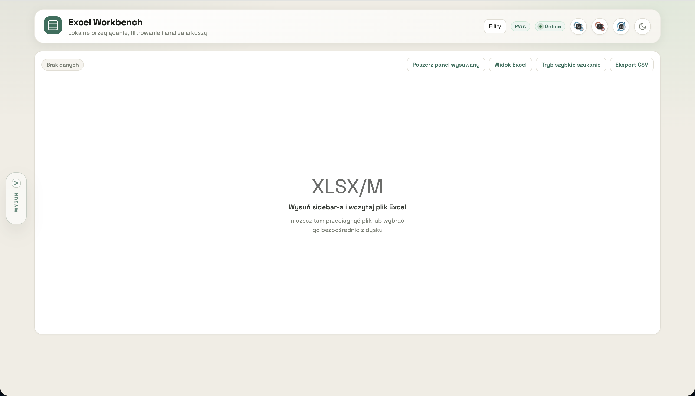

# Excel Workbench PWA

Local, offline-first workbook workbench for exploring, filtering, restructuring, and lightly editing Excel files in the browser.

It is built for the moments when classic Excel feels too heavy, too awkward, or simply unavailable, especially on tablets and PWA-style workflows where macros are not a realistic option.

## Screenshots


Main view with the sidebar collapsed.


Main view with the sidebar expanded.

## Why This Exists

This project came out of a real workflow need, not from a generic idea for "Excel in the browser".

In practice, there are many situations where Excel starts to break down for everyday work:

- the file is hard to understand quickly
- the workflow is awkward on tablet or in a browser
- the task would normally push you toward macros or complicated multi-step manual work
- the data needs inspection, restructuring, or repeated analysis more than classic spreadsheet authoring

This project exists because a lot of real Excel work is not really about spreadsheet authoring. It is about:

- understanding messy workbooks quickly
- filtering and comparing data faster than in standard Excel flows
- working safely on iPad or in the browser
- replacing some macro-shaped workflows with simpler local tools

The goal is not to clone Excel.

The goal is to build a workbench around Excel files:

- local-first
- safe for source files
- useful on desktop and tablet
- better at inspection, filtering, structure discovery, and lightweight analysis
- able to handle some tasks that normally require macros, VBA, or overly complicated Excel workflows

## What It Already Does

- open `.xlsx` and `.xlsm` files locally in the browser
- work without a backend
- support offline usage through a service worker
- choose sheet and header row
- filter by text and date
- sort and save working views
- inspect workbook structure
- detect repeated column blocks
- switch some wide sheets into `Wide-to-Long`
- run lightweight aggregation and duration analysis
- browse formulas in a dedicated workbench
- export CSV and save edited files

## Product Direction

Excel Workbench PWA is intentionally focused on:

- browsing and understanding workbooks
- workbench-style filtering and analysis
- lightweight transformations that are safe in a browser
- features that still make sense without VBA/macros

It intentionally does not try to become a full Excel replacement.

## Start Locally

Use any simple static server, for example:

```bash
python3 -m http.server 8001
```

Then open:

```text
http://127.0.0.1:8001/
```

## Deploy

This is a static app.

For Vercel:

- Framework: `Other`
- Build command: none
- Output directory: repo root

## Add To Home Screen

On iPad / iPhone:

1. Open the app in Safari.
2. Tap Share.
3. Choose `Add to Home Screen`.

## Privacy And Data Safety

Workbook files are processed locally in the browser.

The app is designed so the Excel file does not need to leave the device. In practice, safety still depends on running a trusted version of the app.

## Offline

The app ships with a service worker and can work offline after the first successful load.

## Public Roadmap

Planned work and longer-term ideas are in [ROADMAP.md](./ROADMAP.md).

## Contributing

Contributions, bug reports, UX suggestions, and workbook-based edge cases are welcome.

If you want to contribute, please read [CONTRIBUTING.md](./CONTRIBUTING.md) first.

## Notes

Some deeper product and research notes are kept in separate files in this repo. They are useful for development context, but `README.md` and `ROADMAP.md` are the main public-facing entry points.
